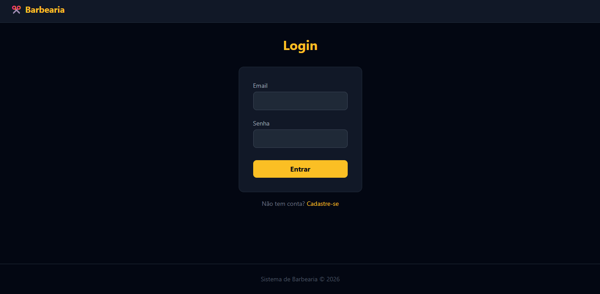
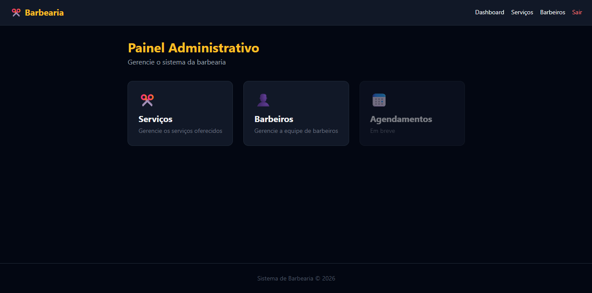
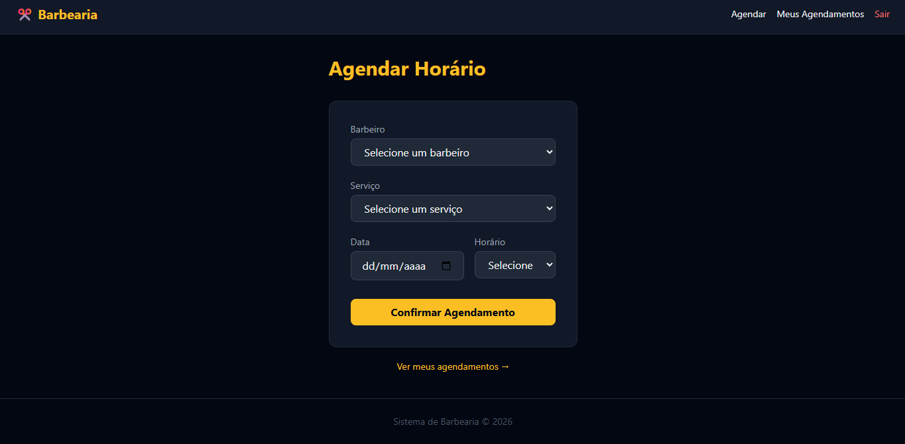
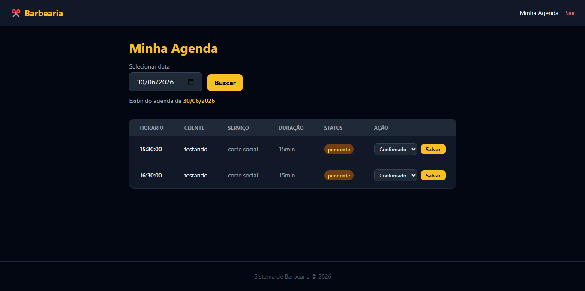

# Sistema de Barbearia

Aplicação web completa para gerenciamento de agendamentos, clientes e barbeiros, desenvolvida como projeto de portfólio.

## 🔗 Demo

Acesse o sistema em produção: [barb-system.rf.gd/barbearia/login](https://barb-system.rf.gd/barbearia/login)

>  ⚠️ Ambiente de demonstração. Para testar, entre em contato ou crie uma conta na tela de registro.

## 📸 Screenshots

### Login


### Painel Administrativo


### Agendar Horário


### Painel do Barbeiro


## 🚀 Tecnologias

- **Back-end:** PHP 8+
- **Banco de dados:** MySQL 8
- **Acesso ao banco:** PDO com prepared statements
- **Front-end:** HTML5, CSS3, JavaScript
- **CSS Framework:** Tailwind CSS (via CDN)
- **Arquitetura:** MVC sem framework
- **Versionamento:** Git/GitHub

## ⚙️ Funcionalidades

- Cadastro e login com roles: admin, barbeiro e cliente
- Middleware de autenticação e proteção de rotas por role
- Agendamento online com verificação de disponibilidade de horário
- Painel do barbeiro com agenda filtrável por data
- Painel administrativo com CRUD de serviços e barbeiros
- Upload de foto dos barbeiros
- Interface responsiva (mobile-first)
- Validações no frontend (JS) e no backend (PHP)

## 🗄️ Banco de Dados

- Script SQL: [`database/schema.sql`](database/schema.sql)
- Diagrama: [`database/diagrama.png`](database/diagrama.png)

## 🔧 Como rodar localmente

1. Clone o repositório dentro da pasta `htdocs` do XAMPP:
```bash
git clone https://github.com/GabrielS0306/sistema_barbearia.git
```

2. Inicie o **Apache** e o **MySQL** no XAMPP Control Panel

3. Crie o banco de dados no phpMyAdmin:
   - Nome: `barbearia`
   - Execute o script: `database/schema.sql`

4. Copie o arquivo de configuração:
```bash
cp config/database.example.php config/database.php
```

5. Ajuste as credenciais em `config/database.php` se necessário

6. Acesse: `http://localhost/barbearia/login`

## 📁 Estrutura do projeto

```
barbearia/
├── app/
│   ├── controllers/
│   ├── models/
│   └── views/
├── config/
├── core/
├── database/
└── public/
```

## 🔮 Próximas funcionalidades

- Painel admin com visão geral de agendamentos
- Geração de PDF de relatórios e comprovantes (DOMPDF)
- Sistema de pagamento (PIX e cartão via Mercado Pago)
- Envio de e-mail de confirmação (PHPMailer)
- Proteção CSRF nos formulários
- Soft delete de barbeiros  